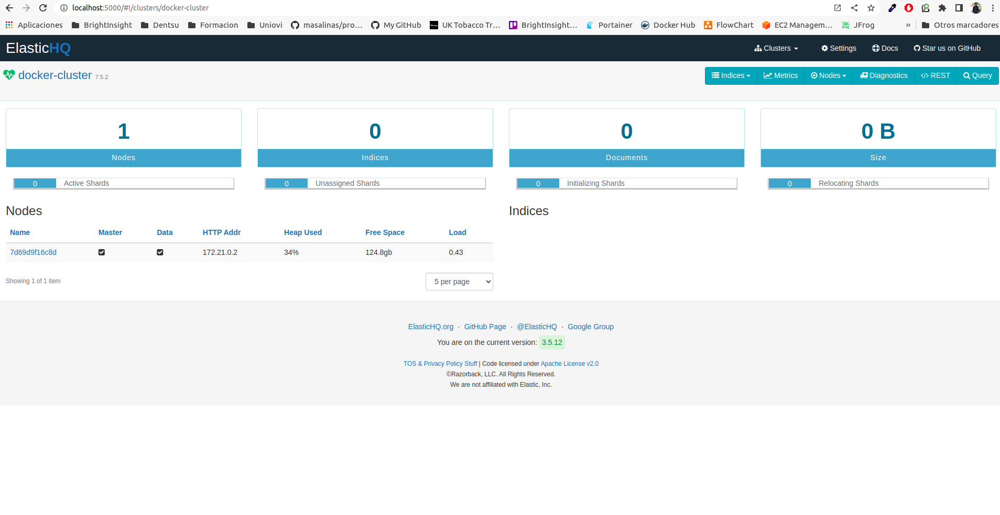

# Description
Genome Importer Elastic JS

# Infrastructure
Execute this command to create the infrastructure about database:

Create a network in docker called genome

```
docker network create genome
```

Start single node elasticsearch cluster in development mode in this network

```
docker run -d --name genome-elastic-db -p 9200:9200 -p 9300:9300 -e "discovery.type=single-node" --network=genome docker.elastic.co/elasticsearch/elasticsearch:7.5.2
```

Start elasticHQ to manage the cluster in this network

```
docker run -d -p 5000:5000 --name elasticsearch-hq elastichq/elasticsearch-hq
```


# Connect to Elasticsearch

Recover the elasticsearch cluster node
```
docker inspect -f '{{range.NetworkSettings.Networks}}{{.IPAddress}}{{end}}' genome-elastic-db

172.21.0.2
```

Open elasticHQ in browser at http://localhost:5000 and connect to http://172.21.0.2 elasticsearch cluster




# Dataset
We must download The Cancer Genome Atlas (TCGA) Dataset locally in the default folder called downloaded_data, previous to import in mongoDB

# Execution
Execute this command to import the dataset in mongoDB:

```
npm install

node --max_old_space_size=8048 app.js
```

genome-db database:

# Links

- [Elasticsearh docker documentation](https://www.elastic.co/guide/en/elasticsearch/reference/7.5/docker.html)